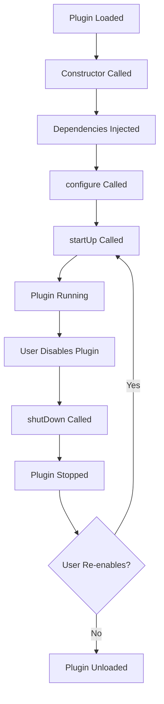

## Overview

RuneLite plugins follow a well-defined lifecycle managed by the `PluginManager`. Understanding this lifecycle is crucial for proper resource management and avoiding memory leaks.

## Lifecycle Phases



## Lifecycle Methods

### Constructor

```java
public class MyPlugin extends Plugin
{
    // Constructor is called when plugin class is loaded
    public MyPlugin()
    {
        // Avoid doing work here - dependencies not yet injected
        // This is called before @Inject fields are populated
    }
}
```

<Warning>
Do not access `@Inject` fields in the constructor - they are not initialized yet.
</Warning>

### configure(Binder binder)

Called before dependency injection to set up Guice bindings.

```java
@Override
public void configure(Binder binder)
{
    // Bind custom implementations
    binder.bind(MyService.class).to(MyServiceImpl.class);
}
```

<Info>
Most plugins don't need to override this method. Use it only for custom dependency bindings.
</Info>

### startUp()

Called when the plugin is enabled. This is where you initialize resources.

```java
@Override
protected void startUp() throws Exception
{
    // Register overlays
    overlayManager.add(myOverlay);
    
    // Register key listeners
    keyManager.registerKeyListener(inputListener);
    
    // Initialize state
    resetState();
    
    log.info("Plugin started");
}
```

**Common startUp() tasks:**
- Register overlays with `OverlayManager`
- Register key/mouse listeners
- Initialize plugin state
- Schedule recurring tasks
- Load cached data

### shutDown()

Called when the plugin is disabled. Clean up all resources here.

```java
@Override
protected void shutDown() throws Exception
{
    // Remove overlays
    overlayManager.remove(myOverlay);
    
    // Unregister listeners
    keyManager.unregisterKeyListener(inputListener);
    
    // Clear state
    clearState();
    
    log.info("Plugin stopped");
}
```

**Common shutDown() tasks:**
- Remove overlays
- Unregister all listeners
- Cancel scheduled tasks
- Clear cached data
- Reset UI modifications

<Warning>
Always clean up resources in `shutDown()`. Failure to do so causes memory leaks and can crash the client.
</Warning>

### resetConfiguration()

Called when the user clicks "Reset" in the plugin configuration panel.

```java
@Override
public void resetConfiguration()
{
    // Clear stored data
    configManager.unsetConfiguration(CONFIG_GROUP, "savedData");
    
    // Reset runtime state
    resetState();
}
```

## Event Subscription Lifecycle

Event handlers using `@Subscribe` are automatically managed:

```java
@Subscribe
public void onGameTick(GameTick event)
{
    // Automatically registered during startUp()
    // Automatically unregistered during shutDown()
}
```

The `PluginManager` scans for `@Subscribe` methods and registers them with the `EventBus`.

<Note>
You don't need to manually register/unregister `@Subscribe` methods - this is handled automatically.
</Note>

## Complete Lifecycle Example

```java BossTimerPlugin.java
package net.runelite.client.plugins.bosstimer;

import com.google.inject.Provides;
import java.util.HashMap;
import java.util.Map;
import javax.inject.Inject;
import net.runelite.api.Client;
import net.runelite.api.NPC;
import net.runelite.api.events.NpcDespawned;
import net.runelite.api.events.NpcSpawned;
import net.runelite.client.config.ConfigManager;
import net.runelite.client.eventbus.Subscribe;
import net.runelite.client.plugins.Plugin;
import net.runelite.client.plugins.PluginDescriptor;
import net.runelite.client.ui.overlay.OverlayManager;

@PluginDescriptor(
    name = "Boss Timer",
    description = "Tracks boss spawn timers"
)
public class BossTimerPlugin extends Plugin
{
    @Inject
    private Client client;
    
    @Inject
    private OverlayManager overlayManager;
    
    @Inject
    private BossTimerOverlay overlay;
    
    @Inject
    private BossTimerConfig config;
    
    private final Map<Integer, Long> bossTimers = new HashMap<>();
    
    // Constructor - dependencies not yet available
    public BossTimerPlugin()
    {
        // Don't access injected fields here
    }
    
    @Override
    protected void startUp() throws Exception
    {
        log.info("Boss Timer plugin starting up");
        
        // Register overlay
        overlayManager.add(overlay);
        
        // Clear any stale data
        bossTimers.clear();
    }
    
    @Override
    protected void shutDown() throws Exception
    {
        log.info("Boss Timer plugin shutting down");
        
        // Remove overlay
        overlayManager.remove(overlay);
        
        // Clear state
        bossTimers.clear();
    }
    
    @Override
    public void resetConfiguration()
    {
        log.info("Resetting Boss Timer configuration");
        
        // Clear all saved timers
        bossTimers.clear();
    }
    
    // Event handlers - automatically managed
    @Subscribe
    public void onNpcSpawned(NpcSpawned event)
    {
        NPC npc = event.getNpc();
        if (isBoss(npc))
        {
            bossTimers.put(npc.getIndex(), System.currentTimeMillis());
            log.debug("Boss spawned: {}", npc.getName());
        }
    }
    
    @Subscribe
    public void onNpcDespawned(NpcDespawned event)
    {
        NPC npc = event.getNpc();
        bossTimers.remove(npc.getIndex());
    }
    
    private boolean isBoss(NPC npc)
    {
        return config.trackedBosses().contains(npc.getId());
    }
    
    public Map<Integer, Long> getBossTimers()
    {
        return bossTimers;
    }
    
    @Provides
    BossTimerConfig provideConfig(ConfigManager configManager)
    {
        return configManager.getConfig(BossTimerConfig.class);
    }
}
```

## Common Patterns

### Scheduled Tasks

```java
@Inject
private ScheduledExecutorService executor;

private ScheduledFuture<?> scheduledTask;

@Override
protected void startUp()
{
    // Schedule recurring task
    scheduledTask = executor.scheduleAtFixedRate(
        this::updateState,
        0,
        1,
        TimeUnit.SECONDS
    );
}

@Override
protected void shutDown()
{
    // Cancel scheduled task
    if (scheduledTask != null)
    {
        scheduledTask.cancel(false);
        scheduledTask = null;
    }
}
```

### Lazy Initialization

```java
private ExpensiveResource resource;

@Subscribe
public void onGameStateChanged(GameStateChanged event)
{
    if (event.getGameState() == GameState.LOGGED_IN)
    {
        // Initialize expensive resource only when needed
        if (resource == null)
        {
            resource = new ExpensiveResource();
        }
    }
}

@Override
protected void shutDown()
{
    // Clean up
    if (resource != null)
    {
        resource.cleanup();
        resource = null;
    }
}
```

### State Reset on Login/Logout

```java
@Subscribe
public void onGameStateChanged(GameStateChanged event)
{
    if (event.getGameState() == GameState.LOGIN_SCREEN)
    {
        // User logged out - reset state
        resetState();
    }
    else if (event.getGameState() == GameState.LOGGED_IN)
    {
        // User logged in - initialize
        initializeState();
    }
}
```

## Best Practices

<AccordionGroup>
  <Accordion title="Always Clean Up in shutDown()" icon="broom">
    Every resource allocated in `startUp()` must be released in `shutDown()`:
    - Overlays removed from `OverlayManager`
    - Listeners unregistered
    - Scheduled tasks cancelled
    - Collections cleared
    - File handles closed
  </Accordion>
  
  <Accordion title="Handle startUp() Exceptions" icon="triangle-exclamation">
    If `startUp()` throws an exception, the plugin fails to load:
    
    ```java
    @Override
    protected void startUp() throws Exception
    {
        try
        {
            initializeExpensiveResource();
        }
        catch (Exception e)
        {
            log.error("Failed to initialize resource", e);
            // Clean up partial state
            cleanup();
            throw e; // Re-throw to fail startup
        }
    }
    ```
  </Accordion>
  
  <Accordion title="Don't Access Game State in startUp()" icon="exclamation">
    The client may not be logged in when `startUp()` is called:
    
    ```java
    @Override
    protected void startUp()
    {
        // DON'T: client.getLocalPlayer() may be null
        // Player player = client.getLocalPlayer();
        
        // DO: Wait for a game event
        // Player will be available in event handlers
    }
    ```
  </Accordion>
  
  <Accordion title="Use resetConfiguration() for User Data" icon="rotate-left">
    Implement `resetConfiguration()` to clear user-specific data:
    
    ```java
    @Override
    public void resetConfiguration()
    {
        // Clear saved locations
        locations.clear();
        
        // Reset counters
        configManager.unsetConfiguration(GROUP, "counter");
    }
    ```
  </Accordion>
</AccordionGroup>

## Debugging Lifecycle Issues

### Enable Debug Logging

```java
@Override
protected void startUp() throws Exception
{
    log.debug("startUp() called");
    log.debug("Client state: {}", client.getGameState());
    log.debug("Config loaded: {}", config);
}

@Override
protected void shutDown()
{
    log.debug("shutDown() called");
    log.debug("Resources to clean: {}", resourceCount);
}
```

### Common Issues

<Warning>
**Memory Leak**: Overlays not removed in `shutDown()`
```java
// BAD
protected void shutDown()
{
    // Forgot to remove overlay
}

// GOOD
protected void shutDown()
{
    overlayManager.remove(overlay);
}
```
</Warning>

<Warning>
**NullPointerException**: Accessing game state too early
```java
// BAD
protected void startUp()
{
    Player player = client.getLocalPlayer(); // May be null
}

// GOOD
@Subscribe
public void onGameTick(GameTick event)
{
    Player player = client.getLocalPlayer();
    if (player != null) { /* ... */ }
}
```
</Warning>

## Related Topics

<CardGroup cols={2}>
  <Card title="Creating Plugins" icon="plus" href="/plugins/creating-plugins">
    Learn how to create your first plugin
  </Card>
  <Card title="Event Bus" icon="bolt" href="/concepts/event-bus">
    Understand the event system
  </Card>
  <Card title="Configuration" icon="gear" href="/plugins/config-management">
    Manage plugin settings
  </Card>
  <Card title="Best Practices" icon="star" href="/plugins/best-practices">
    Plugin development guidelines
  </Card>
</CardGroup>
